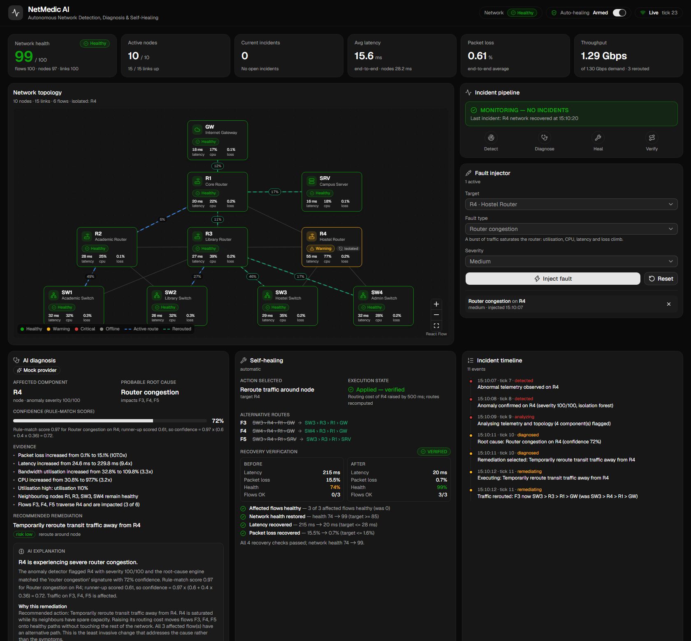
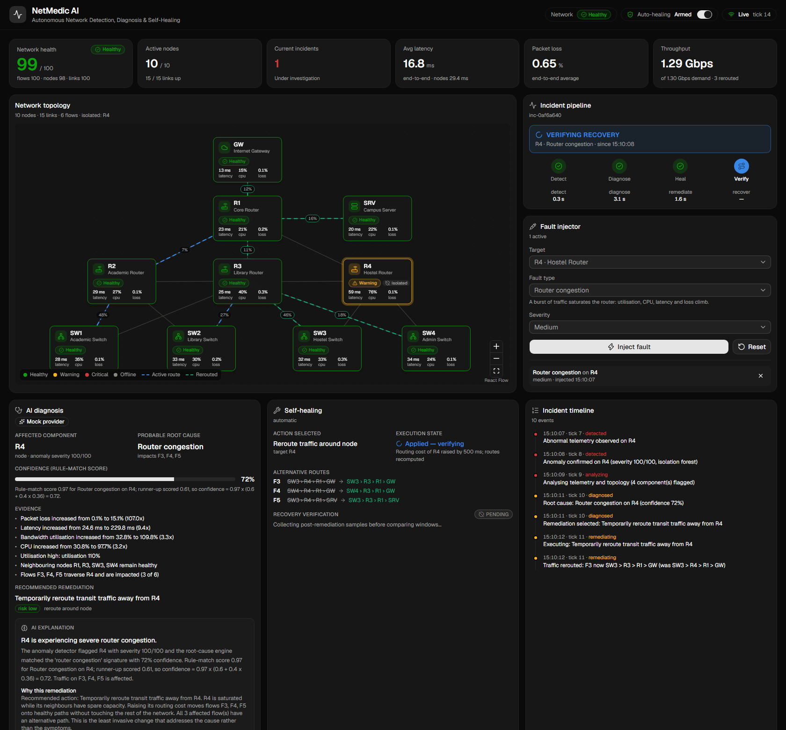
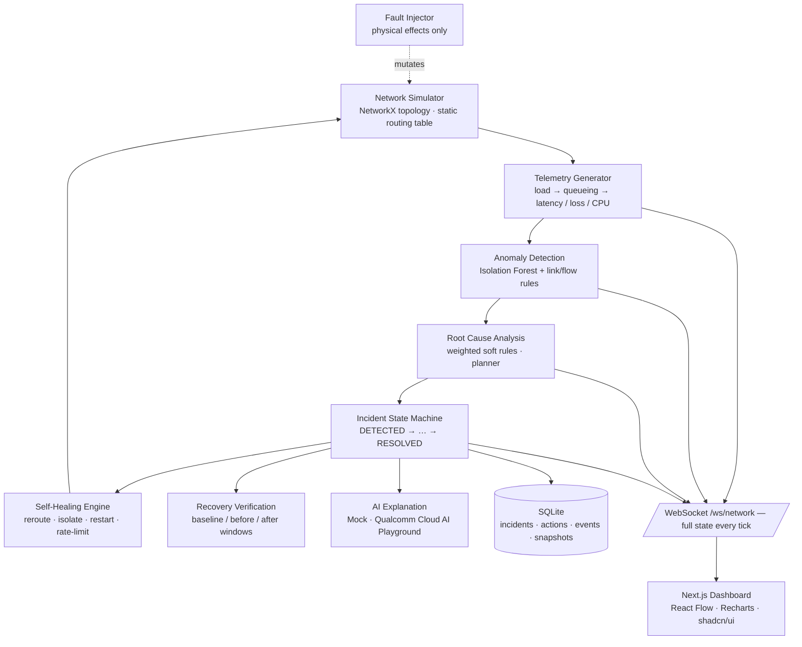
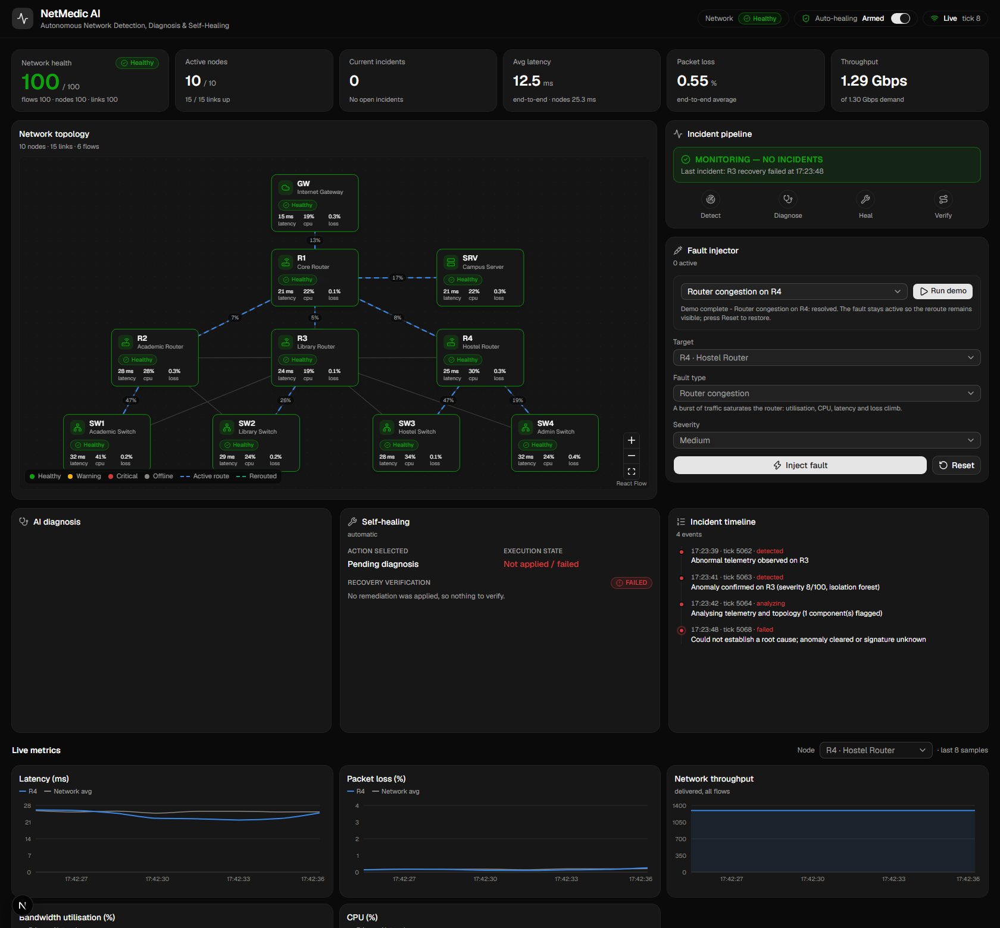

# NetMedic AI

**Autonomous Network Detection, Diagnosis & Self-Healing Platform**

| | |
|---|---|
| **Hackathon** | Infosys IGNITE ENGNEXT 2026 – Hack-AI-Thon |
| **Problem Statement** | NC-04 — Self-Healing Network Simulator |
| **Status** | Functional MVP — full Detect → Diagnose → Heal → Verify loop working end to end |



---

## Overview

NetMedic AI is a functional, AI-assisted network simulator that continuously monitors
telemetry from a simulated campus network, detects degradation or failures with an
Isolation Forest, works out the most probable root cause with an explainable rule engine,
**changes the simulated network** to fix it (reroute, isolate, restart, rate-limit) and
then **verifies** — with before/after telemetry windows — that the network really recovered.

```
MONITOR → DETECT → DIAGNOSE → DECIDE → HEAL → VERIFY
```

It is deliberately **not** an LLM chatbot. Network state, telemetry, anomaly detection,
root-cause analysis, rerouting and recovery verification are all programmatic
(NetworkX + scikit-learn + deterministic scoring). The GenAI layer only turns the
structured diagnosis into an operator-friendly explanation, and the system keeps working
without it.

## Problem

Modern campus/enterprise networks degrade in ways that take operators minutes to notice
and longer to diagnose. Most monitoring stops at "alert fired". NC-04 asks for a
simulator that closes the loop: detect the fault, work out *why*, fix it, and prove it is
fixed — visibly and in real time.

## What the demo shows (≈15 s)

1. A healthy 10-node campus network with animated active routes.
2. **Router R4 → Congestion → Inject Fault** (or **Run demo**).
3. R4's latency, loss and CPU climb; the Isolation Forest confirms the anomaly on the next tick.
4. The root-cause engine identifies *Router congestion on R4* with evidence and a 70-75 % confidence whose formula is printed.
5. The planner simulates a reroute, confirms every affected flow has an alternative path, and the healing engine raises R4's routing cost and recomputes Dijkstra paths — Hostel and Admin traffic now flows through R3 (highlighted on the topology).
6. After a settle period the verifier compares windows: latency 215 ms → 20 ms, loss 15.5 % → 0.7 %, health 74 → 99 — **NETWORK RECOVERED**.
7. The incident, its timeline, actions and recovery report are stored in SQLite and listed in the history table.



## Key Features

- **Physics-based simulator** — node load is derived from the routing table, so a reroute genuinely changes utilisation, queueing latency, loss and CPU on every node.
- **Seven fault types** with severity: router congestion, link failure, packet-loss spike, bandwidth degradation, node overload, traffic spike, complete router failure.
- **Ground-truth isolation** — the fault injector exposes only physical effects; detection, RCA and healing never see fault labels (enforced by tests).
- **ML detection** — Isolation Forest on baseline-normalised features, zero false positives over 200 healthy ticks, every fault detected on the first tick, 2-tick confirmation against flapping.
- **Explainable RCA** — weighted soft rules per hypothesis; the confidence *is* the rule-match score discounted by the runner-up, and the formula is shown in the UI.
- **Real self-healing** — reroute around node/link, isolate link, restart node (with traffic moved off meanwhile), rate-limit a bursting source; quarantine with hold-down timers; automatic restoration of primary routes once telemetry stays clean.
- **Mandatory verification** — baseline / before / after windows and four explicit checks → RESOLVED, PARTIALLY_RESOLVED or FAILED, with time-to-detect / diagnose / remediate / recover metrics.
- **Honest escalation** — if no alternative path exists (core router R1, uplink GW–R1) the plan is ESCALATE and the incident fails visibly instead of pretending.
- **Live dashboard** — React Flow topology, stat tiles, incident pipeline stepper, diagnosis + AI explanation, healing + verification report, timeline, history, small-multiple charts, manual-approval mode.
- **Demo mode** that drives the *real* pipeline for four scenarios.

## Architecture



One `SimulationEngine` runs a 1.5 s tick loop. Each tick: fault expiry → healing housekeeping
(restarts, auto-restore) → fault effects → telemetry → detection → RCA → incident state machine →
persistence → broadcast. The incident machine advances one stage per tick so every transition is
visible: `DETECTED → ANALYZING → DIAGNOSED → REMEDIATING → VERIFYING → RESOLVED | PARTIALLY_RESOLVED | FAILED`.

### Topology

```
                 GW  (Internet Gateway)
                  |
                 R1  (Core Router) ─── SRV (Campus Server)
              /   |   \
            R2 ─ R3 ─ R4            distribution routers with lateral links
            |  \/ |  \/ |  \
          SW1  SW2  SW3  SW4        access switches, each dual-homed (primary + backup uplink)
```

Six traffic flows (Academic/Library/Hostel/Admin → Internet, Hostel/Academic → Server) ride
Dijkstra shortest paths. Routing weight = base latency + congestion penalty + loss penalty +
healing penalties; DOWN nodes/links are excluded.

### Network health score (0–100)

```
component score = 100 × (1 − max over metrics of clamp((value − ok) / (bad − ok), 0, 1))
health          = 0.45 × mean(flow scores) + 0.35 × mean(node scores) + 0.20 × mean(link scores)
```

Thresholds live in `backend/app/telemetry/health.py`; the three sub-scores are shown on the
dashboard so the number is always explainable.

### Detection

- Features per node: latency / healthy RTT, packet loss, throughput / capacity, utilisation, CPU, memory, connections / expected.
- Training data: fault-free simulator runs (6 seeds × 400 ticks, per-flow demand jitter ± 35 %, diurnal swing ± 15 %).
- `IsolationForest(n_estimators=200, contamination=0.005)`; model persisted with joblib and trained automatically on first boot (~20 s).
- Severity 0–100 is derived linearly from the decision function between the training threshold and a worst-case vector — it is **not a probability** and is labelled as such.

### Root cause & confidence

For every flagged component and applicable hypothesis (router congestion, node overload,
traffic spike, node failure, link failure, packet-loss spike, bandwidth saturation):

```
score(H)   = Σ weight_i × strength_i / Σ weight_i        strength = clamp((value − ok)/(bad − ok))
confidence = best × (0.6 + 0.4 × (1 − runner_up / best))
```

Evidence combines the detector's baseline deviations ("Latency increased from 25 ms to 230 ms (9.4×)"),
strong symptoms, neighbour context and impacted flows.

### Verification

Windows: baseline (5 samples before the anomaly), before (3 samples before remediation), after
(3 samples following a 2-sample settle). Checks: affected flows healthy · health ≥ 85 · latency ≤
1.5 × baseline + 10 ms · loss ≤ baseline + 1 %. All pass → RESOLVED; ≥ half or +10 health → PARTIALLY_RESOLVED; else FAILED.

## Technology Stack

**Frontend:** Next.js 16, React 19, TypeScript, Tailwind CSS v4, shadcn/ui, React Flow (`@xyflow/react`), Recharts
**Backend:** Python 3.11, FastAPI, Pydantic v2, Uvicorn, WebSockets
**Simulation & ML:** NetworkX, NumPy, Pandas, scikit-learn (Isolation Forest), joblib
**Database:** SQLite via SQLAlchemy 2
**GenAI:** `AIExplanationProvider` abstraction — `MockProvider` (default) and `QualcommProvider` for Qualcomm Cloud AI Playground, configured only through environment variables
**Ops:** Docker, Docker Compose, GitHub

## Screenshots

| Healthy network | Incident in progress | Incident resolved |
|---|---|---|
|  |  |  |

## Setup

### Prerequisites

- Node.js 20+ and npm
- Python 3.11+
- (optional) Docker Desktop

### Environment variables

Copy `.env.example` to `.env` and adjust if needed. Defaults work out of the box. Never commit `.env`.

| Variable | Purpose |
|---|---|
| `NETMEDIC_TICK_SECONDS` | telemetry/pipeline tick (default 1.5) |
| `NETMEDIC_DATABASE_URL` | SQLite URL (default `sqlite:///./data/netmedic.db`, relative to `backend/`) |
| `NETMEDIC_CORS_ORIGINS` | allowed dashboard origins |
| `NETMEDIC_AI_PROVIDER` | `mock` (default) or `qualcomm` |
| `QUALCOMM_AI_BASE_URL` / `QUALCOMM_AI_API_KEY` / `QUALCOMM_AI_MODEL` | Qualcomm Cloud AI Playground details supplied by you (see `backend/app/ai/qualcomm.py` for the documented request-shape assumption) |
| `NEXT_PUBLIC_API_BASE_URL` / `NEXT_PUBLIC_WS_URL` | where the browser reaches the backend |

### Backend

```bash
cd backend
python -m venv .venv
.venv\Scripts\activate          # Windows
# source .venv/bin/activate     # macOS / Linux
pip install -r requirements.txt
uvicorn app.main:app --reload --port 8000
```

First start trains the Isolation Forest (≈20 s) and writes `backend/data/models/`. Retrain any time with
`python ../scripts/train_detector.py`. Interactive API docs: http://localhost:8000/docs.

### Frontend

```bash
cd frontend
npm install
npm run dev
```

Open http://localhost:3000.

### Tests

```bash
cd backend
pytest            # 90+ tests: routing, telemetry, faults, detection, RCA, healing, verification, incidents, AI, DB, demo
```

### Docker

```bash
docker compose up --build                                   # backend on :8000, dashboard on :3000
BACKEND_PORT=8010 FRONTEND_PORT=3010 docker compose up --build   # if those ports are taken
```

The backend trains the detector on first boot (~10 s in the container); the SQLite database and model live in the `netmedic-data` volume. The dashboard URLs are baked into the frontend image at build time, so pass the port variables to `build` as well when changing them.

## Demo Workflow

1. Start backend and frontend — the topology renders healthy (health ≈ 100).
2. Either press **Run demo** (scenario *Router congestion on R4*) or choose **Target R4 → Router congestion → Medium → Inject fault**.
3. Watch the **Incident pipeline** card step through Detect → Diagnose → Heal → Verify; R4 pulses on the topology.
4. **AI diagnosis** shows the root cause, evidence, confidence formula and the recommended action; **Self-healing** shows the alternative routes (F3/F4/F5 now via R3) and, ~8 s later, the before/after verification report.
5. Rerouted paths glow aqua on the topology; R4 is marked *Isolated*. Charts show R4's spike and the flows' recovery.
6. **Incident history** lists the incident with recovery and total durations. Press **Reset** to restore the primary routes.
7. Try the other scenarios (link failure, traffic spike, node overload) or switch **Auto-healing** off to approve remediations manually.

## API

| Method | Route | Purpose |
|---|---|---|
| GET | `/api/health` | liveness |
| GET | `/api/network/topology` · `/api/network/status` | nodes, links, flows, routes |
| GET | `/api/telemetry/current` · `/api/telemetry/history?limit=` | latest snapshot / chart series |
| GET · POST · POST · DELETE | `/api/faults` · `/api/faults/inject` · `/api/faults/reset` · `/api/faults/{id}` | fault injection |
| GET | `/api/detection/current` · `/api/detection/model` | anomalies / model metadata |
| GET | `/api/diagnosis/current` | live root-cause analysis |
| GET | `/api/incidents` · `/api/incidents/active` · `/api/incidents/{id}` | incident records |
| POST · GET/POST | `/api/healing/{incident_id}/execute` · `/api/healing/mode` | manual approval / auto-heal toggle |
| GET · POST | `/api/ai/provider` · `/api/ai/explain/{incident_id}` | AI explanation |
| GET · POST | `/api/demo/scenarios` · `/api/demo/run` · `/api/demo/stop` · `/api/demo/status` | demo mode |
| WS | `/ws/network` | full state every tick |

## Repository Structure

```
netmedic-ai/
├── frontend/                 Next.js dashboard
│   ├── app/                  layout + page
│   ├── components/dashboard/ topology, panels, charts, fault injector, demo control
│   ├── hooks/                WebSocket hook
│   └── lib/                  API client, types, status helpers
├── backend/
│   ├── app/
│   │   ├── api/              REST + WebSocket routers
│   │   ├── simulation/       topology, routing, network state, faults, effects
│   │   ├── telemetry/        generator + health score
│   │   ├── detection/        features, trainer, Isolation Forest detector
│   │   ├── diagnosis/        rules, RCA, remediation planner
│   │   ├── healing/          healing engine + recovery verifier
│   │   ├── incidents/        incident state machine
│   │   ├── ai/               explanation providers (mock, Qualcomm)
│   │   ├── database/         SQLAlchemy models + repository
│   │   ├── models/           Pydantic schemas
│   │   ├── engine.py         tick loop orchestrator
│   │   └── demo.py           demo scenarios
│   ├── tests/
│   └── requirements.txt
├── docs/                     screenshots, architecture notes
├── scripts/train_detector.py
├── CONTEXT.md                persistent project memory for AI sessions
├── docker-compose.yml
└── .env.example
```

## Future Improvements

- Multi-incident correlation and cascading-failure diagnosis
- Additional detectors (per-node models, seasonal baselines, autoencoders) and online retraining
- Policy engine with approval thresholds by risk level
- Topologies loaded from YAML and larger multi-site graphs
- Exportable incident reports (PDF / Markdown)

## License

MIT
