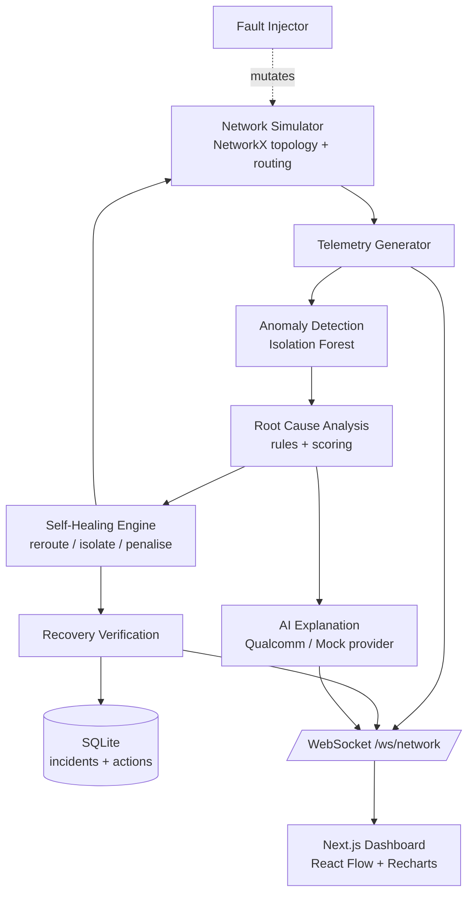

# NetMedic AI

**Autonomous Network Detection, Diagnosis & Self-Healing Platform**

| | |
|---|---|
| **Hackathon** | Infosys IGNITE ENGNEXT 2026 – Hack-AI-Thon |
| **Problem Statement** | NC-04 — Self-Healing Network Simulator |
| **Status** | Phase 0 — project initialization |

---

## Overview

NetMedic AI is a functional, AI-assisted network simulator that continuously monitors
network telemetry, detects degradation or failures, identifies the most probable root
cause, executes a corrective action on the simulated network, and then **verifies** that
the network actually recovered.

```
MONITOR → DETECT → DIAGNOSE → DECIDE → HEAL → VERIFY
```

The system is **not** an LLM chatbot. Network state, telemetry, anomaly detection,
root-cause analysis, rerouting and recovery verification are all implemented
programmatically (NetworkX + scikit-learn + deterministic rule scoring). The GenAI
component only turns the structured diagnosis into a human-readable explanation.

## Problem

Modern campus/enterprise networks fail in ways that take operators minutes to notice and
longer to diagnose. Most monitoring tools stop at "alert fired". NC-04 asks for a
simulator that closes the loop: detect the fault, work out *why*, fix it, and prove it is
fixed.

## Proposed Solution

| Stage | Implementation |
|---|---|
| Monitor | NetworkX topology + realistic fluctuating telemetry generator streamed over WebSockets |
| Detect | scikit-learn Isolation Forest trained on synthetic healthy telemetry |
| Diagnose | Hybrid deterministic root-cause engine (rules + weighted scoring + neighbour context) |
| Decide / Explain | `AIExplanationProvider` abstraction — Qualcomm Cloud AI Playground or Mock fallback |
| Heal | Self-healing engine that mutates routing weights, isolates links and recomputes Dijkstra paths |
| Verify | Before/after telemetry windows → RESOLVED / PARTIALLY_RESOLVED / FAILED |

## Key Features

- Live topology visualisation (React Flow) with health-coloured nodes and animated active routes
- Interactive fault injector: congestion, link failure, packet-loss spike, bandwidth degradation, node overload, traffic spike
- ML anomaly detection that never reads the injected fault label (ground truth is only used for evaluation)
- Explainable root cause with evidence list and rule-derived confidence
- Real rerouting on the simulated graph — not a message
- Mandatory recovery verification with timing metrics
- Persistent incident history & audit log (SQLite)
- One-click Demo Mode that drives the *real* pipeline

## Architecture



## Technology Stack

**Frontend:** Next.js, React, TypeScript, Tailwind CSS, shadcn/ui, React Flow, Recharts
**Backend:** Python, FastAPI, Pydantic, Uvicorn, WebSockets
**Simulation & ML:** NetworkX, NumPy, Pandas, scikit-learn (Isolation Forest), joblib
**Database:** SQLite (SQLAlchemy)
**GenAI:** Qualcomm Cloud AI Playground via provider abstraction (Mock fallback)
**Ops:** Docker, Docker Compose, Git/GitHub

## Screenshots

_Coming soon._

## Setup

### Prerequisites

- Node.js 20+
- Python 3.11+
- (optional) Docker Desktop

### Environment variables

Copy `.env.example` to `.env` and adjust as required. Never commit `.env`.

### Backend

```bash
cd backend
python -m venv .venv
# Windows
.venv\Scripts\activate
# macOS / Linux
source .venv/bin/activate
pip install -r requirements.txt
uvicorn app.main:app --reload --port 8000
```

### Frontend

```bash
cd frontend
npm install
npm run dev
```

Open http://localhost:3000.

### Tests

```bash
cd backend
pytest
```

### Docker

```bash
docker compose up --build
```

## Demo Workflow

1. Start backend and frontend — the topology renders healthy.
2. Select **Router R4 → Congestion → Inject Fault** (or press **Run Demo**).
3. Watch telemetry deteriorate, the anomaly detector fire, and root cause appear with evidence.
4. The healing engine raises R4's routing cost and recomputes paths — the topology shows the new route.
5. Recovery verification compares before/after windows and marks the incident **RESOLVED**.
6. The incident remains in history with detection / diagnosis / remediation / recovery timings.

## Repository Structure

```
netmedic-ai/
├── frontend/          Next.js dashboard
├── backend/
│   ├── app/
│   │   ├── api/         REST + WebSocket routes
│   │   ├── simulation/  NetworkX topology, routing, fault injection
│   │   ├── telemetry/   telemetry generator
│   │   ├── detection/   Isolation Forest anomaly detection
│   │   ├── diagnosis/   root-cause analysis engine
│   │   ├── healing/     self-healing + recovery verification
│   │   ├── ai/          AI explanation providers
│   │   ├── database/    SQLite / SQLAlchemy
│   │   └── models/      Pydantic schemas
│   ├── tests/
│   └── requirements.txt
├── docs/
├── scripts/
├── CONTEXT.md         persistent project memory for AI sessions
├── docker-compose.yml
└── .env.example
```

## Future Improvements

- Additional detectors (LSTM autoencoder, seasonal baselines)
- Multi-fault correlation and cascading-failure diagnosis
- Policy engine for human-in-the-loop approval of risky remediations
- Export of incident reports (PDF / Markdown)
- Pluggable topologies loaded from YAML

## License

MIT
